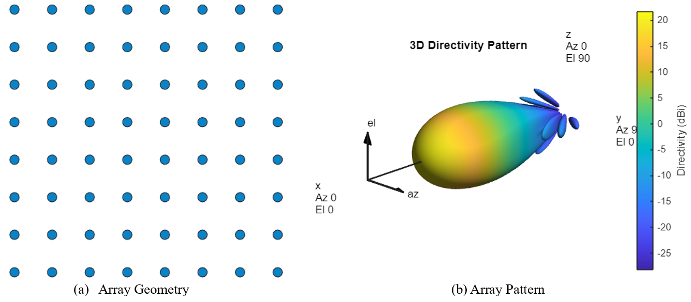

# Improving Wireless Communication Performance with Intelligent Reflective Surfaces (IRS)

## Introduction

This repository contains the code, resources, and practical prototype details for a project focused on enhancing wireless communication performance using Intelligent Reflective Surfaces (IRS). The primary objective of this project is to demonstrate that electromagnetic radiation can be steered and its pattern altered passively through the use of IRS (passive beamforming). Additionally, the project presents practical use cases where the implementation of IRS significantly improved signal strength and coverage.

## Project Overview

### Abstract Problem

The main challenge addressed by this project is the passive beamforming of electromagnetic waves. The goal is to change the direction and pattern of the waves passively without active components. Passive solutions like IRS are preferred over active solutions like relays because they consume less power, reduce complexity, and lower costs.

The following image summarizes the problem, the solution, and a practical scenario where IRS can be useful. It shows how an IRS can steer the signal around obstacles to reach a target receiver, thereby improving signal strength and coverage.

  

### Solution

Intelligent Reflective Surfaces (IRS) are proposed as a solution to achieve passive beamforming. By dynamically controlling which unit cells of the IRS are active, we can steer the direction and alter the pattern of electromagnetic waves. The following images [1] demonstrate that controlling which unit cells to activate can indeed change the direction and pattern as desired.

  
  

These figures illustrate how different configurations of IRS unit cells result in varied beam patterns, showcasing the effectiveness of passive beamforming through IRS. In the subsequent sections, this will be further validated using CST by designing a unit cell, then an IRS array from said unit cell, and finally controlling columns of the IRS array rather than individual cells and seeing that pattern change is in fact feesible. This approach is sufficient as a proof of concept and is appropriate for being cost-effective and compatible with the available equipment for testing the physical prototype.

### CST Simulation

In this section, we explore the design and simulation of the IRS using CST Microwave Studio. The primary objective of the unit cell design was to achieve a 180-degree phase shift at 2.44 GHz between the two states (diode on/off), and the objective of the whole IRS array is to achieve passive beamforming as described earlier.

#### System Design

##### Unit Cell Design and Configuration

The IRS design begins with the unit cell geometry, crucial for achieving the desired phase shift. Below are the 2D and 3D views of the unit cell components.

  

These views provide an understanding of the unit cell structure, which includes a PIN diode, ground plane, substrate, and reflective patch.

##### S-Parameters Analysis

The phase response of the S-parameters is crucial for verifying the unit cell achieves the 180-degree phase shift at 2.44 GHz. The plot below shows the S-parameters.

  

This plot demonstrates the phase shift achieved between the two states of the diode, confirming the unit cell design's effectiveness.

##### IRS Array Construction

Unit cells are combined into a 4x9 array to scale the functionality over a larger surface, enabling effective signal manipulation.

  

This array configuration forms the basis for practical IRS implementation in wireless communication systems.

#### System Evaluation

By changing the IRS configuration from 111111111 to 110000011, the signal pattern changes, demonstrating the IRS's ability to steer signals to previously unseen receivers. The following images illustrate this change.

  
  

  
  

### MATLAB Simulation

The MATLAB simulation replicates a realistic scenario where IRS is used to improve a practical communication system. The primary objectives are:

1. **Increasing Received Power:** Ensuring the signal power at the receiver reaches an acceptable level.
2. **Improving Coverage Map:** Expanding the coverage area to include previously uncovered locations.
3. **Stabilizing the System:** Increasing system reliability by guaranteeing a virtual LOS path from the IRS.

#### Design

##### Transmitter

The transmitter operates at a center frequency of 32 GHz with an 8x8 URA layout, 40% wavelength spacing, and a Chebyshev taper to minimize sidelobes and improve directivity.

 

##### IRS Array

The IRS array consists of multiple reflecting elements in a 50x50 URA layout, 40% wavelength spacing, and a Chebyshev taper. 

   
   

##### Simulation Setup

The simulation models the Hashemite University campus, including typical obstacles such as buildings that obstruct the direct line of sight between the transmitter and receivers. The IRS is strategically placed to reflect signals towards the receivers, optimizing the communication path.

  

#### Use Case 1: Enhancing Communication for Obstacled Users

In this scenario, the system's performance is evaluated for users obstructed by obstacles.
**Setup Enviroment**

  

 

1. **Base Station Antenna Radiation:** The initial radiation pattern is directed towards the users, and the signal strength is measured at each user location for baseline comparison.

   

2. **Beamforming Towards Users:** Active beamforming techniques are applied to enhance signal strength at both user locations, showing potential improvement.

   

3. **IRS-Assisted Signal Relay:** The IRS is configured to relay the signal to the obstructed user, significantly improving the received power level and showcasing the IRS's capability in challenging environments.

   

#### Evaluation

The following table shows the numerical results for the scenario. The received power for each user is evaluated for every setup step, and the Rician factor is calculated based on the power delay profile (calculated and plotted in the code).

| Setup | User 1 Received Power (dBm) | User 2 Received Power (dBm) | User 2 Rician Factor |
|-------|-----------------------------|-----------------------------|----------------------|
| Without Active Beamforming & without IRS | -83.311 | -98.8642 | 0.116 |
| With Active Beamforming & without IRS | -29.222 | -60.9307 | 0.14 |
| With Active Beamforming & with IRS | -29.222 | -49.46453 | 267.2848 |

#### Use Case 2: Improving Communication for a Mobile User

In this scenario, the system's performance is evaluated for a mobile user moving between five different points.

  

1. **Without IRS:** The signal strength is measured at five points without using the IRS. This provides a baseline measurement of the signal coverage.
2. **With IRS:** The IRS is enabled to assist in relaying the signal to the mobile user. This scenario demonstrates the IRS's effectiveness in improving signal strength and coverage.

The received signal strength at each point is evaluated, and a graph is generated to visualize the differences. Additionally, coverage maps for each point are presented to show how the IRS can track a mobile user in an NLOS environment.

**Comparing the Received Power in dBm between IRS and Non-IRS System**

  

**Coverage Maps to Four Different Points**

  

### Physical Prototype

The transmitter for this project was ideally a USRP, but due to unavailability at the university at the time (now they have it), a transmitter unit operating at 2.4 + X GHz was used. Here, X is n*27 MHz, where \( n \) (0, 1, 2, 3) is controlled by the combinations of two switches. The output of the transmitter unit is connected to a Yagi antenna. 

At the receiver, an identical Yagi antenna is used, connected to a spectrum analyzer to detect a peak at the center frequency, indicating a received signal with an appropriate power level.

The IRS was designed using EasyEDA and manufactured by JLCPCB from China. The design and specifications are as follows:

#### IRS PCB Design

  

#### IRS Specifications
| Specification     | Value               | Reason for Selection                                                                 |
|-------------------|---------------------|--------------------------------------------------------------------------------------|
| Base Material     | FR-4                | Excellent electrical insulation properties and mechanical strength for stability and reliability. |
| Layers            | 2                   | Allows efficient routing and component placement, balancing complexity and manufacturability. |
| Dimensions        | 210x450 mm          | Provides ample space for the 4x9 array configuration while maintaining a manageable board size. |
| PCB Thickness     | 16 mm               | Ensures durability and stability, withstanding handling and installation processes. |
| Surface Finish    | HASL (with lead)    | Ensures good solderability and longevity, protecting against oxidation and maintaining performance. |

#### Parts List and Quantities
| ID    | Name            | Quantity | Manufacturer Part    | Manufacturer | Supplier | Supplier Part  | Price   |
|-------|------------------|----------|----------------------|--------------|----------|----------------|---------|
| 1     | HDR-SMD_10P     | 1        | X6251WS-2x05H        | XKB          | LCSC     | C780052        | 0.176   |
| 2     | SMP-1320-79LF   | 36       | SMP1320-79LF         | Skyworks     | LCSC     | C150854        | 0.285   |

The IRS array uses HDR-SMD_10P connectors and SMP-1320-79LF PIN diodes. These components ensure stable performance and dynamic phase shifting for effective signal manipulation.

The physical IRS prototype integrates all components to validate theoretical and simulated performance in practice. The array consists of a 4x9 matrix of unit cells.

  

To simulate an obstacle, another IRS array was used, with all unit cells turned on, making the IRS function as a perfect reflector at the center frequency.

Unfortunately, practical evaluation was not completed due to issues with the transmitter unit and the lack of cheap, available alternatives in Jordan within the project's timeframe. Despite these challenges, significant progress was achieved within a month—a commendable effort considering the enrollment period started around April 7 and the prototype was ordered on May 10. The project, as it stands, is more than sufficient for a graduation project. However, out of respect for one's own efforts and hunger for knowldege. Also, lack of closure sucks, there is a substantial interest in completing it outside of the university, though not immediately, as the university holds the equipment and the prototype.

## Installation and Setup
### Prerequisites
- MATLAB
- CST Microwave Studio
- EasyEDA

  
Completing this section is useless now.

## Simulation Files

I might publish a paper from this project later on, and I don't want it published by others yet. Therefore, the simulation files are not included in this public repository. If you are interested in these files, send me an email at [rawashdeh758@gmail.com](mailto:rawashdeh758@gmail.com) provided that your reasons are good enough.

## Creators

This project was entirely developed by Hashem Rawashdeh and Mohammad Asaslih. No other individuals contributed to the creation or development of this work.

### Contact Information

- **Hashem Rawashdeh**  
  Email: [rawashdeh758@gmail.com](mailto:rawashdeh758@gmail.com)  
  Phone: +962-77-994-7450

- **Mohammad Asaslih**  
  Email: [abo.3sool1999@gmail.com](mailto:abo.3sool1999@gmail.com)  
  Phone: +962-78-250-9494

## References
1. Yang, H. et al. A programmable metasurface with dynamic polarization, scattering and focusing control. Sci. Rep. 6, 35692 (2016).
